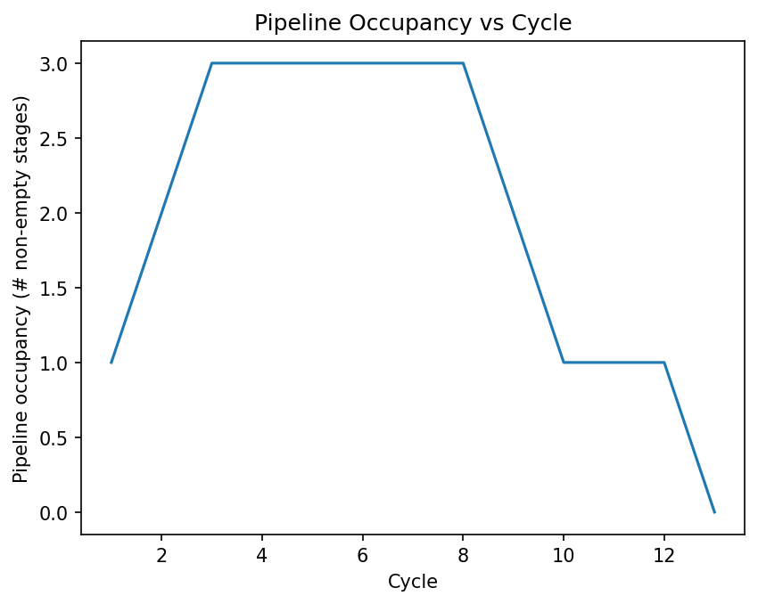
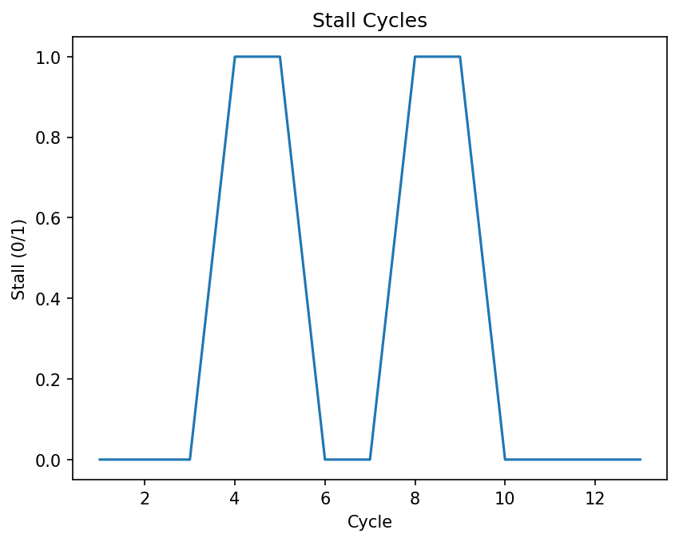

# 🧠 CPU Pipeline Simulator


A **cycle-accurate 5-stage CPU pipeline simulator** that models **instruction-level parallelism**, **RAW data hazards**, and **stall/bubble behavior**, with **quantitative performance analysis** using **NumPy**, **Pandas**, and **Matplotlib**.

---

## 🚀 Highlights

- ⏱️ Cycle-accurate simulation  
- 🔁 RAW data hazard detection  
- 🧱 Pipeline stalls & bubble insertion  
- 📊 CPI, stall rate, and pipeline utilization analysis  
- 📈 Matplotlib performance visualizations  
- 🧪 User-defined or hardcoded instruction streams  
- 💾 CSV export of per-cycle pipeline trace  

---

## 🖥️ Pipeline Architecture

The simulator models a classic **5-stage in-order RISC-style pipeline**, where each instruction progresses through one stage per cycle unless stalled due to hazards.

```
IF  →  ID  →  EX  →  MEM  →  WB
```

### Pipeline Stages

- **IF — Instruction Fetch**  
  Fetches the next instruction from the instruction stream using the program counter (PC).  
  In this simulator, IF represents the arrival of a new instruction into the pipeline.

- **ID — Instruction Decode / Register Read**  
  Decodes the instruction and identifies source (`src`) and destination (`dst`) registers.  
  RAW data hazards are detected at this stage by comparing source registers against pending writes from older in-flight instructions.

- **EX — Execute**  
  Performs the instruction’s computation (e.g., arithmetic or logic operations).  
  When a stall occurs, a **bubble (None / NOP)** is injected into this stage to prevent incorrect execution.

- **MEM — Memory Access**  
  Represents the memory stage of the pipeline.  
  Although this simulator focuses on ALU instructions, MEM is explicitly modeled to preserve realistic pipeline timing.

- **WB — Write Back**  
  Writes the result back to the destination register, completing the instruction.  
  Once an instruction reaches WB, it is considered **retired**, and its result is architecturally visible.

### Execution Semantics

- The pipeline advances **cycle-by-cycle**
- Multiple instructions may be in-flight simultaneously
- RAW hazards may temporarily stall the pipeline
- Instructions drain naturally after the final fetch

This structure enables realistic modeling of **instruction-level parallelism**, **pipeline stalls**, and **performance trade-offs**.

---

## ⚠️ Hazard Model

- RAW hazards are detected in the **ID stage**
- An instruction stalls if it reads a register written by an older instruction in:
  - **EX**
  - **MEM**
- **WB is treated as architecturally complete**
- Stall behavior:
  - IF & ID are frozen
  - A bubble(None) is shifted into EX
  - Older instructions continue draining

---

## 📊 Performance Metrics

Derived **directly from the per-cycle execution trace**:

- Total cycles
- Instructions retired
- Stall cycles & stall rate
- Cycles Per Instruction (CPI)
- Average pipeline occupancy

All metrics are computed using **Pandas** and **NumPy**, reflecting real performance-analysis workflows.

---

## 📈 Performance Visualizations

### Pipeline Occupancy vs Cycle


This plot illustrates how the pipeline fills, stalls, and drains over time.  
Occupancy increases during initial fill, temporarily drops during RAW hazard stalls, and decreases again as the pipeline drains after the final instruction is fetched. The average occupancy provides a quantitative measure of instruction-level parallelism.

### Stall Cycles Timeline


This timeline highlights cycles where pipeline stalls are inserted due to data hazards.  
Each stall corresponds to a bubble injected into the EX stage to preserve correctness in the absence of forwarding. The distribution of stall cycles directly impacts CPI.

Together, these visualizations demonstrate how **microarchitectural hazards translate into measurable performance penalties**.

---

## 🧪 Example Execution Trace

```
Cycle | IF               | ID               | EX               | MEM              | WB
------|------------------|------------------|------------------|------------------|----------------
1     | ADD x1<-x2,x3    | ----             | ----             | ----             | ----
2     | ADD x4<-x1,x5    | ADD x1<-x2,x3    | ----             | ----             | ----
3     | ADD x8<-x6,x7    | ADD x4<-x1,x5    | ADD x1<-x2,x3    | ----             | ----
4     | (stall)          | ADD x4<-x1,x5    | ----             | ADD x1<-x2,x3    | ----
```

---

## 💡 Skills Demonstrated

### Computer Architecture & Microarchitecture
- Design and modeling of a **5-stage in-order CPU pipeline (IF/ID/EX/MEM/WB)**
- Understanding of **instruction-level parallelism (ILP)** and pipeline fill/drain behavior
- Implementation of **cycle-accurate execution semantics**
- Modeling of **instruction retirement and architectural state visibility**

### Hazard Detection & Control Logic
- Detection of **Read-After-Write (RAW) data hazards**
- Implementation of **stall control and bubble (NOP) insertion**
- Correct handling of **pipeline freezing and draining**
- Clear separation between **hazard detection** and **pipeline control**

### Performance Modeling & Analysis
- Trace-driven performance evaluation using **per-cycle pipeline state**
- Computation of CPI, stall rate, retirement rate, and pipeline utilization
- Analysis of how microarchitectural behavior impacts performance

### Software Engineering (Python)
- Modular project structure with clean separation of concerns
- Use of **classes and data models** to represent instructions
- Finite-state, cycle-driven simulation design
- Clean interfaces between simulation, analysis, and visualization layers

### Data Analysis & Visualization
- Structured analysis using **Pandas**
- Numerical aggregation with **NumPy**
- Performance visualization with **Matplotlib**
- CSV export for offline analysis

---

## 📁 Project Structure

```
cpu-pipeline-sim/
├── instruction.py      # Instruction data model
├── pipeline.py         # Pipeline simulation & hazard logic
├── user_input.py       # Interactive instruction input
├── main.py             # Simulation driver and analysis
├── program_data.csv    # Exported per-cycle trace
└── README.md
```

---

## ▶️ Running the Simulator

```
python main.py
```

- Supports hardcoded or user-entered programs
- Automatically generates:
  - Console performance summary
  - CSV pipeline trace
  - Performance plots

---

## 🔮 Future Extensions

- Data forwarding / bypassing
- Load/store instructions
- Control hazards and branch modeling
- Configurable pipeline depth
- Comparative CPI analysis

---

## 📜 License

MIT License
